<div align="center">

<a href="https://rb3dx.milohax.org"></a>

</div>

# 🔨 Building (NOT standard download and install)
NOTE: This is for *building the game*, for developers and contributors. <br/> If you're looking for downloads, [please visit our website](https://rb3dx.milohax.org/).
---
# Prerequisites
## Python 3
### Windows
* Windows users should [**download Python**](https://www.python.org/downloads/) (version 3.11 or later).
  * **Select "`Add python.exe to PATH`"*** on the installer.  
  > 

Verify that you have Python installed by typing in `where python` and `python --version` into command prompt.  
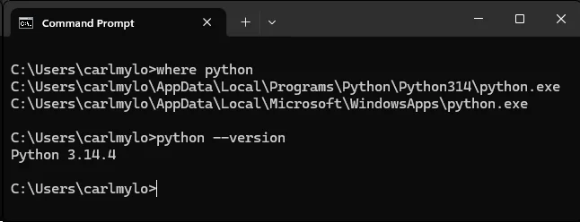

### macOS and Linux
You more than likely already have Python 3 installed. If not, visit [[Python's website]](https://www.python.org/downloads/) and follow the instructions for your operating system.

Verify that you have Python installed by typing in `where python` and `python --version` into your terminal.  
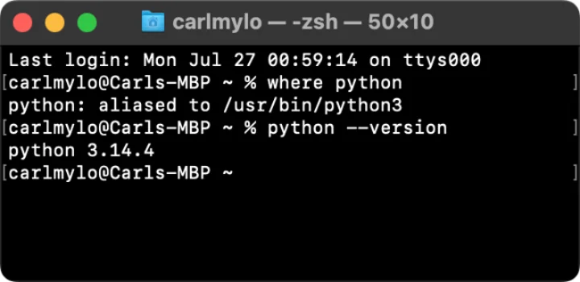

## Git Client
> [!TIP]
> If you already are running a Git client, you can ignore this section.

We have a few recommendations for beginners:
* **[[GitHub Desktop]](https://desktop.github.com/download/)** _(macOS and Windows)_ - **[Recommended] The one most of us use!**
* [[Sublime Merge]](https://www.sublimemerge.com/) _(Linux, macOS, and Windows)_ - Pair this up with SublimeText, which a lot of us also use!
* [[GitKraken]](https://www.gitkraken.com/) _(Linux, macOS, and Windows)_ - Used less but it's a beginner friendly option for Linux users.
* [[Sourcetree]](https://www.sourcetreeapp.com/) _(macOS and Windows)_ - [**Intermediate users**] A pretty elegant option with a great graph view.
* [[Lazygit]](https://github.com/jesseduffield/lazygit) - _(Linux, macOS, and Windows)_ [**Intermediate users**] A pretty neat Git client that runs within your terminal of choice!

## Text Editor
> [!TIP]
> You can use any text editor, but we recommend these since we have [[Syntax files]](https://github.com/hmxmilohax/tools/tree/main/syntax) for them.  
> [[Syntax files]](https://github.com/hmxmilohax/tools/tree/main/syntax) show you where commands within the code and and where there's potentially errors.
* **[[SublimeText]](https://www.sublimetext.com/)** _(Linux, macOS, and Windows)_ - **[Recommended] The one most of us use!**
* [[Notepad++]](https://notepad-plus-plus.org/downloads/) _(Windows)_ - Old but still very useful and reliable text editor preferred by many.
* [[VSCodium]](https://vscodium.com/) _(Linux, macOS, and Windows)_ - A cleaner version of "Visual Studio Code", which is not to be confused with "Visual Studio", which is an entire suite for software development strictly for Windows!
* [[Vim]](https://www.vim.org/) _(Linux, macOS, and Windows)_ - [**Expert users**] If you use this, you probably already figured out how to get all of this working without reading any of this.

<br/>

# 📚 Creating a Fork
> [!TIP]
> If you're not contributing anything to Rock Band 3 Deluxe, you can ignore this section.
1. Click on the `Fork` button near the top of the page then on `Create a new fork`.
> 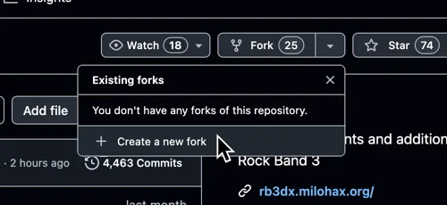
2. Click on the green `Create fork` button at the bottom.
> 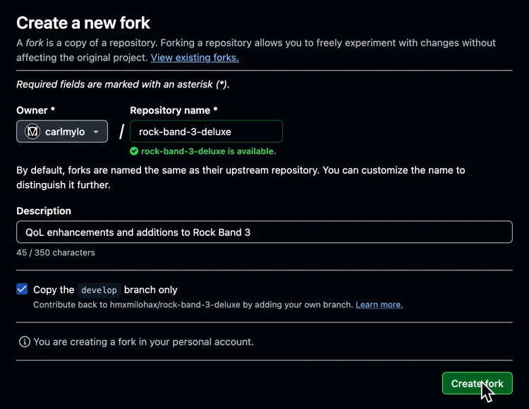
3. On your own fork, click on `Branch` below the name of your repository.
> 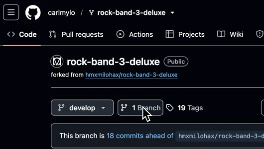
4. Click on the green `New branch` button near the top. This is strongly recommended to keep your changes organized.  
You usually want to name the branch based on what you're changing.  
Change `Source` to `hmxmilohax/rock-band-3-deluxe` and the branch to `develop`.  
Click on `Create new branch` after that.  
> 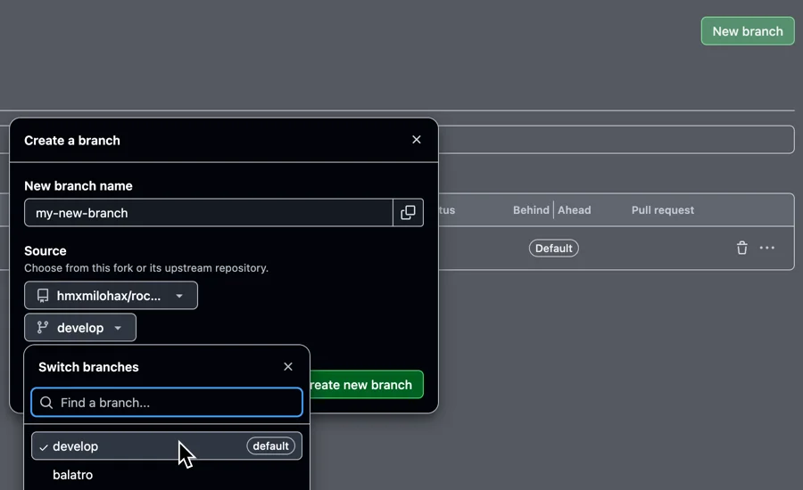
<br/>

# 💾 Cloning the Repository
> [!WARNING]
> The repository can end up taking up around **15 GBs**! Make sure you have plenty of space!
## For Personal Use
1. Open your Git client and clone the Rock Band 3 Deluxe repository by pasting this URL:  
`https://github.com/hmxmilohax/rock-band-3-deluxe.git`
> 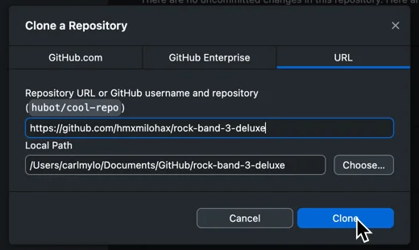
2. Verify the repository cloned correctly by checking the file structure.  
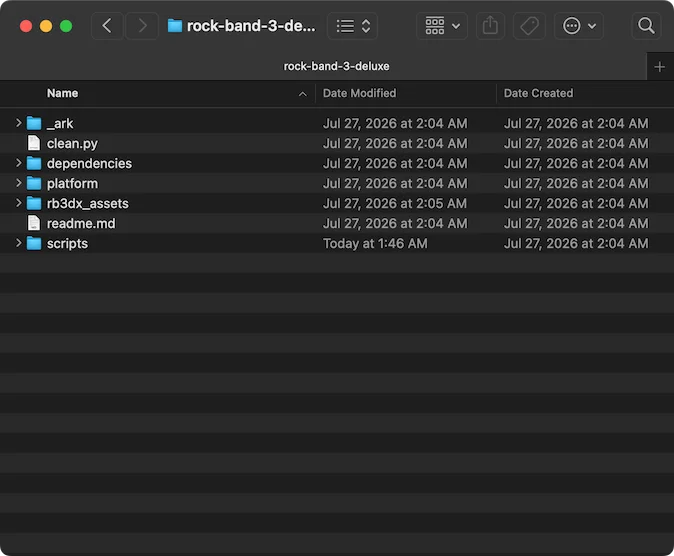

3. ✅ ***The Rock Band 3 Deluxe repo is now set up!***  
From here, you can make any personal modifications to the game or [[build it yourself]](#Building).

## To Contribute
1. If you're contributing to the project, make sure you clone the repository you forked instead.  
It will typically be prefixed by your username, like `YourUsername/rock-band-3-deluxe`.  
> 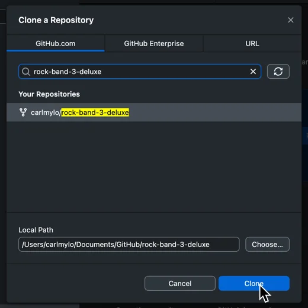
2. Change the branch to the one you want to commit changes to made and pull.
> 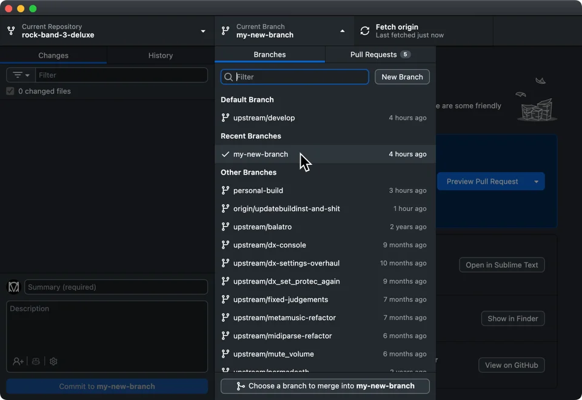
3. Verify the repository cloned correctly by checking the file structure.  
> 
4. Make any changes then [[build]](#Building) Rock Band 3 Deluxe to see if it works.
> 
5. When you've verified your changes work, push your changes and [[open a pull request]](https://docs.github.com/en/desktop/working-with-your-remote-repository-on-github-or-github-enterprise/creating-an-issue-or-pull-request-from-github-desktop) to send your changes back to the main repository.
> 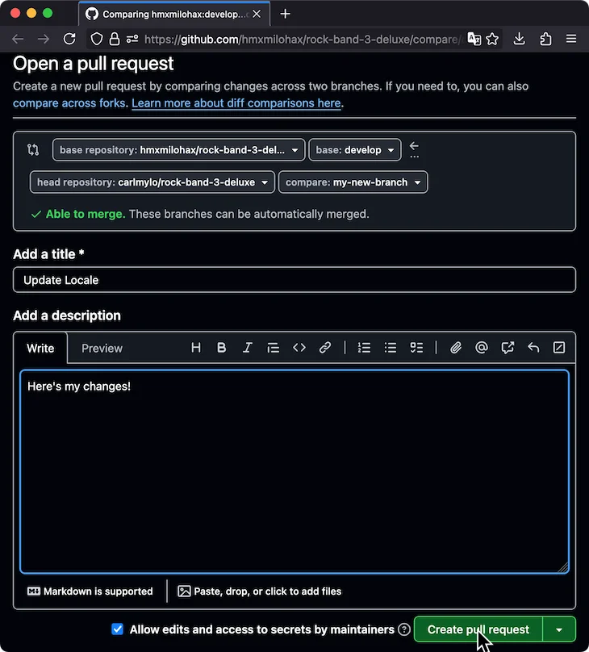
<br/>

# 🚧 Building
> [!CAUTION]
> While you can build a Wii version, we only use it for [[debugging purposes]](#Debugging) nowadays and offer no support for casual Wii play.

## Windows
1. Navigate to `scripts` if you're on Windows.
2. We strongly suggest making a copy of `dx_build_config_default.ini`.  
Rename the copy `dx_build_config.ini` and edit the bits you want to use.  
> 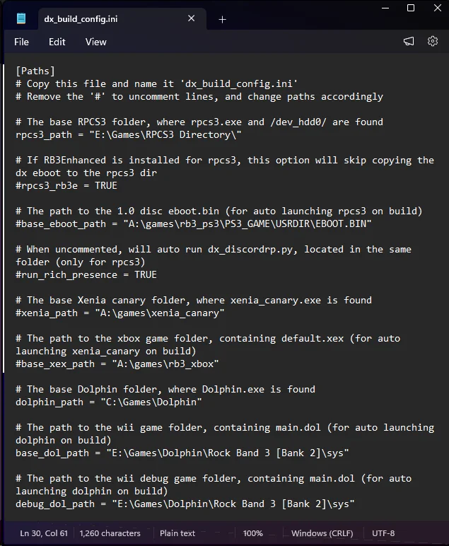
3. Run the `build_` script for your platform of choice to build *Rock Band 3 Deluxe*.  
Built contents will be in the `out` folder on the root of the repo.  
If you've set up your own `dx_build_config.ini` file, the should automatically copy to the folders you specified.

## macOS and Linux
1. Navigate to the root of the repo in your terminal/shell of choice.
2. Run the following commands:
  * `python3 dependencies/python/configure_build.py <platform>`
  * `dependencies/<os>/ninja`  
Built contents will be in the `out` folder on the root of the repo.

3. ✅ ***You have now built Rock Band 3 Deluxe!***

<br/>

# 🎨 Custom Textures
*Follow [**Building**](#building) first in order to properly follow this guide.*

* Copy any `.jpg`, `.png`, or `.bmp` file to the appropriate place in  `\_ark\dx\custom_textures\***\`.
* Re-build the game!

✅ ***Your custom textures have been converted and will show up ingame!***

<br/>

# ⛔ Debugging
> [!TIP]
> If you're not debugging any scripts, you can ignore this section.

Thanks to community efforts, we have access to multiple prototype builds with debugging features.  
This allows us to easily figure out what caused a crash when writing new scripts.

## Downloads
* [[Dolphin]](https://dolphin-emu.org/download/) - If you don't already have it.
* [[Bank 8 Prototype]](https://hiddenpalace.org/Rock_Band_3_(Sep_1,_2010_prototype)) - Use this for anything that **does not** involve online.
* [[Bank 2 Prototype]](https://hiddenpalace.org/Rock_Band_3_(Aug_29,_2010_prototype)) - Use this for any debugging that involves online.

## Dolphin
1. After opening Dolphin, add the directory where you store your games if you haven't already done so.
2. Click on `Options` > `Configuration`.
3. In the `General` section, tick `Enable Cheats`.  
> 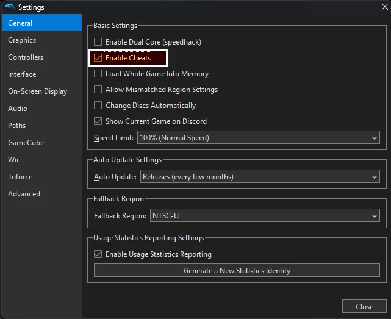
4. In the `Paths` section, it's recommended to enable `Search Subfolders` to list extracted images.  
> 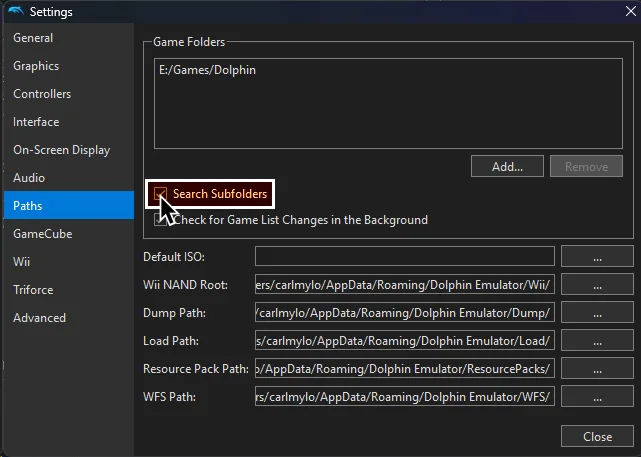
5. In the `Advanced` section, tick `Enable emulated memory size override` and increase `MEM1` and `MEM2` to the max.  
> 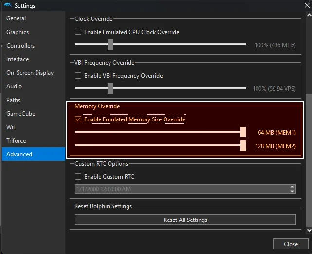
6. Close the `Settings` window when you're done.
7. Right click `Banner` and enable `Tags`, `File Name`, and `File Path`.  
> 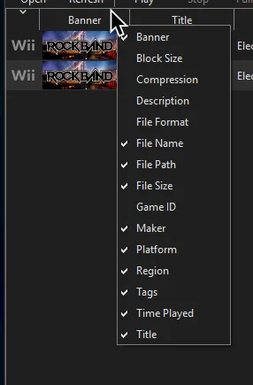
8. At the top, click on `View` and enable both `Show Log` and `Show Log Configuration`.  
Swap to `Log Configuration` and enable `OSReport EXI (OSREPORT)`. You can swap back to the `Log` tab after.  
> 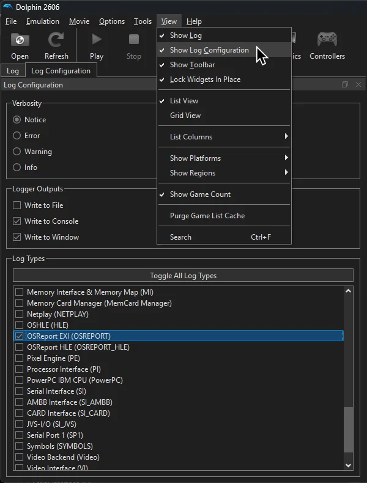
9. Right click whichever Rock Band 3 prototype you want to set up then click `Properties`.
> 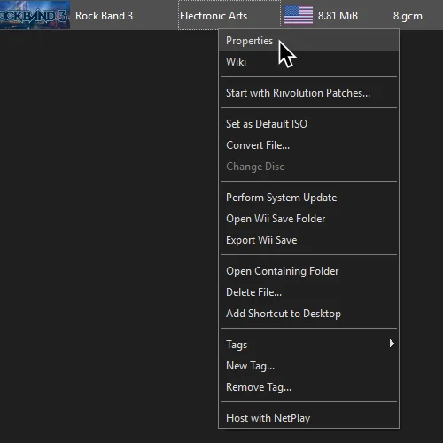
10. **BANK 2 ONLY** - Click on `Gecko Codes`. Add the following Gecko code and enable it:
```06C77FC8 00000018
68747470 3A2F2F6E
61737769 692E6970
672E7077 2F616300
06C78048 00000018
68747470 3A2F2F6E
61737769 692E6970
672E7077 2F707200
```  
> 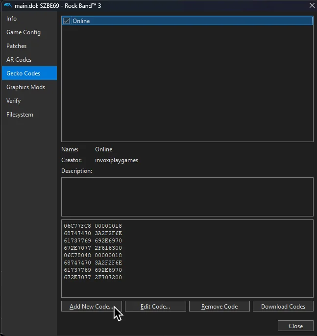
11. Switch to `Filesystem` then right click the `Data Partition`, then click on `Extract Entire Partition...`  
> 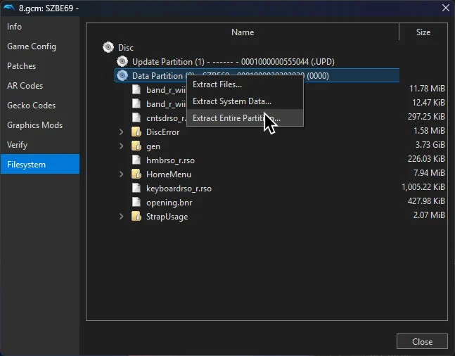
12. It is recommended to make a new folder for each prototype.  
In this example, `8.gcm` was extracted into a new folder called `Rock Band 3 [Bank 8]`.  
> 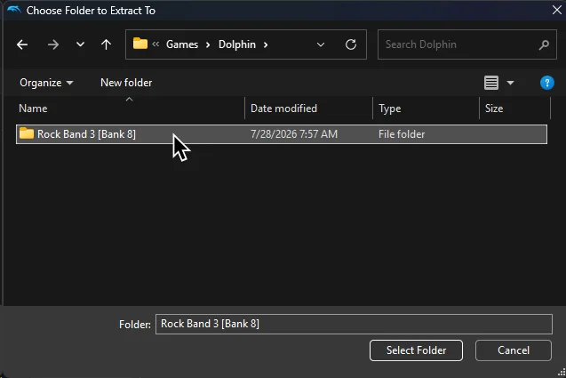
13. Close out the `Properties` window then go to the folder where you extracted the prototype.  
Leave this file browser window open.
14. Open up a new file browser window.  
Navigate to where your Rock Band 3 Deluxe was cloned to.
15. Navigate into `platform/wii` within your Rock Band 3 Deluxe repository folder.
16. Drag the files from the prototype you wish to debug with into the `wii` folder with the `readme.txt` file.  
> 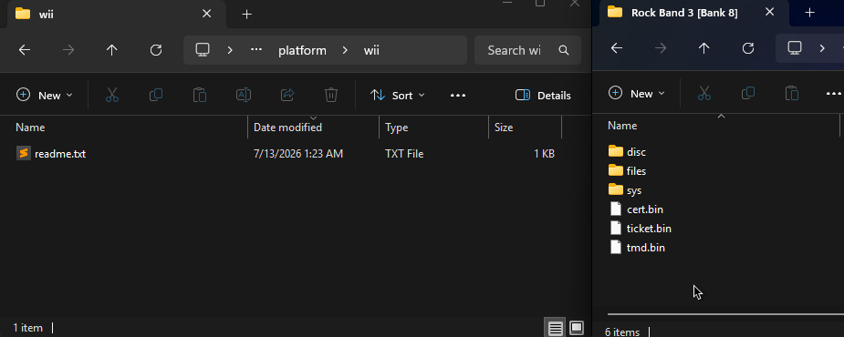
17. You can now make a [[build]](#building).  
If you're on Windows and haven't done so, make sure you follow step 2 in the build instructions to automatically copy the files.

After building and placing the files, launch your new build.  
When you into into an issue, you should see a red error screen.  
This information also shows up in Dolphin's log.  
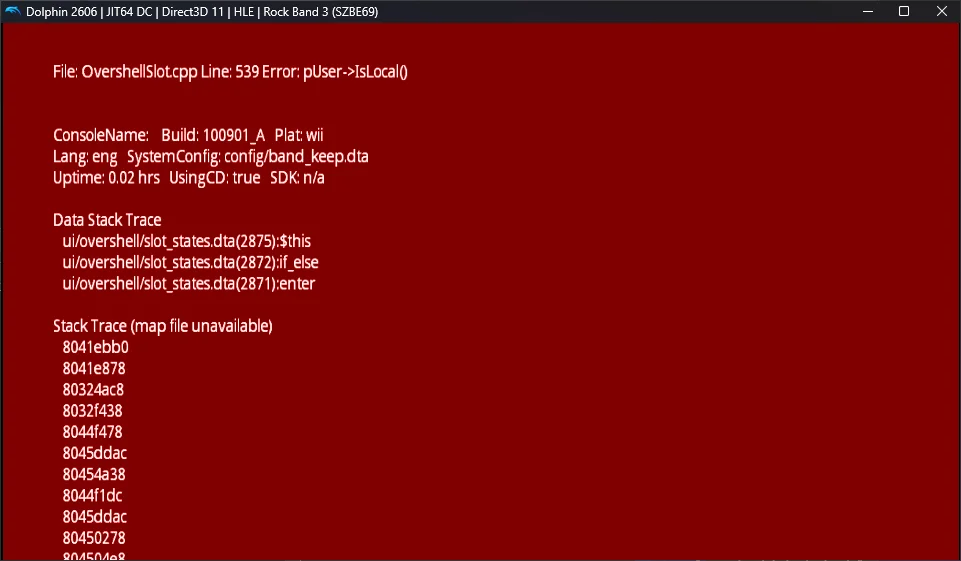

If you want to keep both prototypes, it's recommended to assign tags to the extracted copies of the prototypes to differentiate them.  
> 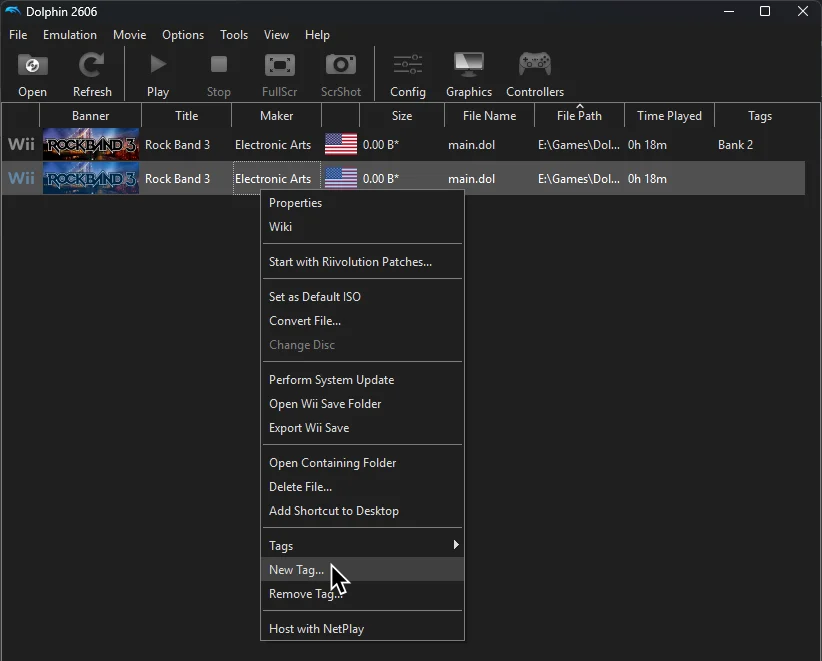

<br/>

# 🖥️ Dependencies

[Git for Windows](https://gitforwindows.org/) - CLI application to allow auto updating Deluxe repo files

[Dot Net 6.0 Runtime](https://dotnet.microsoft.com/en-us/download/dotnet/6.0/runtime) - Needed to run ArkHelper

[Python](https://www.python.org/downloads/) - For user script functionality (NOTE: 3.9 or newer is highly recommended!)

[Mackiloha](https://github.com/PikminGuts92/Mackiloha) - ArkHelper for building Deluxe - SuperFreq for building .bmp_xbox highway images

[swap_rb_art_bytes.py](https://github.com/PikminGuts92/re-notes/blob/master/scripts/swap_rb_art_bytes.py) - Python script for converting Xbox images to PS3

[dtab](https://github.com/mtolly/dtab) - For serializing `.dtb` script files

[RB3DXBuildPkgPS3](https://github.com/InvoxiPlayGames/RB3DXBuildPkgPS3) - For building an RB3DX PKG for PS3

[Wiimmfi ISO Patcher](https://wiimmfi.de/patcher/iso) - For self building an RB3DX image for Wii. Binary locally in repo due to clean download restraints
