## MODIFIERS:

* Drum Navigation:
	* *Navigate the menus by hitting drum pads.*

* Drum Fills:
	* *Toggles the drum freestyles to activate overdrive. If disabled, drummers have to hit the green pad (or green cymbal on Pro Drums) at fixed times to activate.*
 
|  |  |
|---|---|
|  |  |

* Drum Auto Deploy:
	* *Automatically triggers overdrive without having to do a fill. Helpful for people playing drums via piano keyboard.*

* Breakneck Speed:
	* *Speeds up the highway without speeding up the song. Can make it easier to read complex parts by separating the notes more. Consequently, there's less time to react to upcoming notes.*

|  |  |
|---|---|
|  |  |

* Indiv. track speeds:
	* *Lets all highways have their own speed depending on difficulty. Originally, the game would use the lowest difficulty player's speed for everybody.*

* Sync Difficulty Speeds:
	* *Sets all highway speeds to the same as Expert.*

* Beginner Tutorials:
	* *Enables popups to help newcomers.*

* Chord Numbering:
	* *Adds fret number to every fret/string in Pro Guitar/Bass mode.*

|  |  |
|---|---|
| 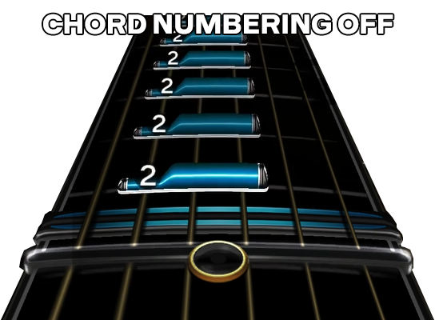 |  |

* Performance Mode:
	* Disables all of the highways when playing a song. Essentially blindfold mode.

* Miss Sounds:
	* *Toggles the sound effects when players miss a note.*

* Awesomeness Detection:
	* *Detects awesomeness.*

* No Whammy FX:
	* *Disables the pitch bending effect when using the whammy bar on guitar and bass.*

* Gem Color Shuffle:
	* *Changes the color of the highway gems overtime.*

|  |  |
|---|---|
| 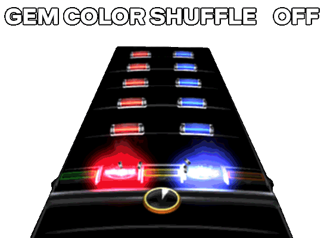 |  |

* No venue intros.
	* *Disables the venue intros when entering a setlist, shortening the start time.*

[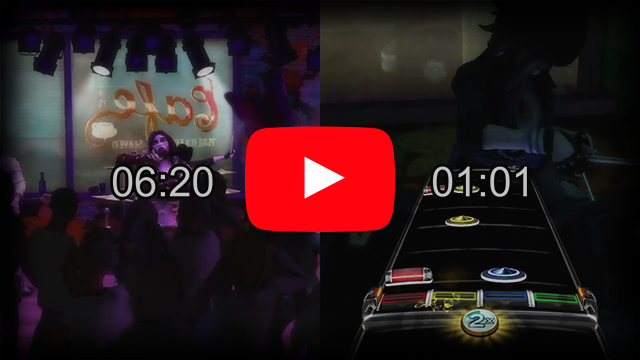](https://youtu.be/4eGFPMPXEDU "Venue Intros Comparison - YouTube")

* Party play:
	* *Keeps the game running when a pause menu is open in local multiplayer.*

* No music videos:
	* *If enabled, prevents music video venues from showing up.*

* Rotate Venues:
	* *Changes the venue/stage after each song.*

* Rotate Bandmates:
	* *Changes which non-player bandmates are on stage after each song.*

* Overdrive in practice:
	* *Allows overdrive phrases to show up in practice mode.*

* No overdrive:
	* *Disables all overdrive phrases in regular play.*

* No Lanes:
	* *Prevents strum lanes from showing up.*

|  |  |
|---|---|
| 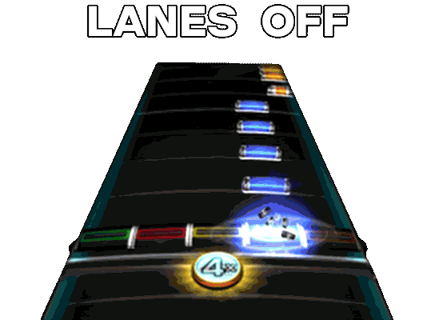 | 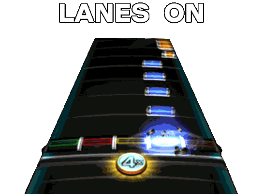 |

* RB4 Lane Behavior:
	* *Makes lanes a bit more forgiving, like in Rock Band 4.*

* Precision Mode:
	* *Shrinks the window for how much time a player has to hit a note. Makes the game drastically harder.*

* Calibration Mode:
	* *Makes the hit window last a single frame. Can help advanced players figure out how their calibration numbers.*

* Drunk Mode:
	* **DISABLES ONLINE!** *Extends the window for how much time players have to hit a note.*

* Always Save DX Settings:
	* Automatically save all edits to Deluxe Settings when exiting.

* Auto Kick:
	* **DISABLES ONLINE!** *Automatically hits kick drum notes for drum players.*

* Jukebox Mode:
	* *Automatically skips results screen when playing a song. Can be doubled up with autoplay and party shuffle to use the game as a radio.*

* Autoplay:
	* **DISABLES ONLINE!** *Makes the game play itself. Good for previewing charts.*

## DELUXE SETTINGS:
**THIS MENU CANNOT BE ACCESSED WHILE ONLINE!**

### SET SPEEDS
* Venue FPS:
	* *Sets the frame rate the background animations run at. Not suggested on console.*

* Note Speed:
	* *Sets the highway speed manually to preference. Basically breakneck speed but with manual control. Can also be set slower than normal.*

* Song Speed:
	* *Increase the speed of the song itself, increasing its pitch as well.*

#### Acceleration:
* Enable/Disable
	* *Enabling this speeds the song up as its played correctly, making it gradually become more difficult.*

* Max Speed:
	* *Changes the top speed for acceleration mode.*

### SELECT VENUE:
* Sets the venue(s)/stage(s) that will be picked when loading into a song.

### APPEARENCE:
#### Track Theme:

   * [Customize]
		* *Customize various aspects of the game's visuals. Most of the settings will have a preview of what they're changing so they're self explanatory.*

		* Shading:
			* *Disables the gradual grey shading on the highway.*

		|  |  |
		|---|---|
		| 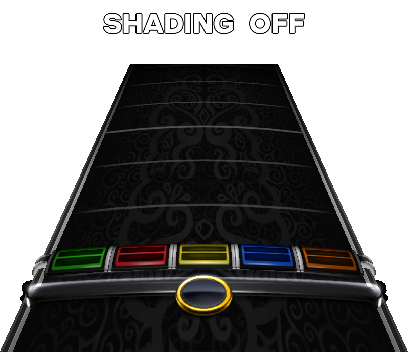 |  |

   * [Save Theme]
		* *Opens the keyboard to name and save all theme edits.*

#### MENU THEME:
* *Changes what the game menus look like.*

#### HUD ELEMENTS:
* *Various options for customizing the interface during a song.*

#### QUICKPLAY HUD:
##### SONG TITLE:
* Visibility:
	* *Changes whether the song info text always stays up, disable it altogether, or behaves like default. "Always" is great for streamers.*

#### POSITION:
* *Move the song title text around. Z-Space is similar to size. It's suggested to adjust these in the* [IN-GAME CUSTOMIZER](#in-game-customizer) *to see changes in real-time.*

* Delay:
	* *Delays the song title popup by a few seconds.*

* Show BPM (if Author Finder is disabled):
	* *Toggles the current tempo of a song.*

#### AUTHOR FINDER:
* *Toggles a variety of extra options for the song title text display.*

#### DISPLAY (if Author Finder is enabled):
* Show BPM:
	* *Toggles the current tempo (beats per minute) of a song.*

* Song Title:
	* *Toggles the song's title.*

* Artist:
	* *Toggles the song's artist.*

* Year:
	* *Toggles the song's release year.*

* Same Line Year:
	* *Combines the release year with whatever is the bottom-most text.*

* Album:
	* *Toggles the album the song is from.*

* Genre:
	* *Toggles the genre the song is.*

* Sub-genre:
	* *Toggles the sub-genre the song is.*

* Source:
	* *Toggles the source of the song. This is usually whether or not this was DLC, a Custom, and so forth.*

* Section:
	* *Toggles which section of the song is currently playing.*

* Author:
	* *Displays the author of the song's chart.*

#### CROWD METER:
* Visible:
	* *Toggles the visibility of the crowd meter on the left side, which shows how well each player is doing.*

* Texture:
	* *Changes the the design of the crowd meter.*

#### SCORE:
* Visible:
	* *Toggles the visibility of the score box, which shows how many points performers currently have.*

* Score Position:
	* *Moves the score box around.  Z-Space is similar to size. It's suggested to adjust these in the* [IN-GAME CUSTOMIZER](#in-game-customizer) *to see changes in real-time.*

* Star Position:
	* *Moves the score box stars around. Z-Space is similar to size. It's suggested to adjust these in the* [IN-GAME CUSTOMIZER](#in-game-customizer) *to see changes in real-time.*

* Solo Box Position:
	* *Moves the position of the solo percentage boxes, which also affects the countdown boxes. Z-Space is similar to size. It's suggested to adjust these in the* [IN-GAME CUSTOMIZER](#in-game-customizer) *to see changes in real-time.*

* [TEXTURES] :
	* *Sets the textures for the Score Box and Stars. Also changes the font for the scores.*

#### PRACTICE HUD:

* All Items:
	* *Moves all visual Practice Mode elements at the same time. Z-Space is similar to size.*

* Speed Control:
	* *Resizes and moves the speed display in practice mode.*

* Percentage Hit:
	* *Resizes and moves the percentage of notes hit in practice mode.*

* Section Header:
	* *Resizes and moves the song section display.*

#### DELUXE HUD:
* Countdown:
	* *Toggles a countdown popup between long breaks, similar to Clone Hero and Rock Band 4.*
	
	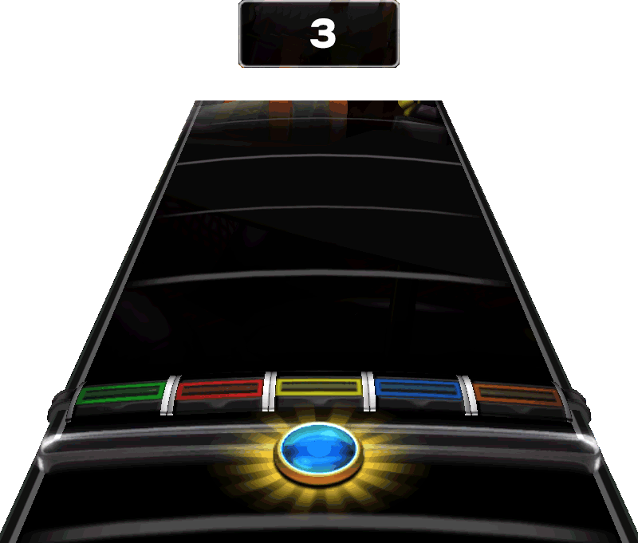

* End Feedback:
	* *Toggles a display at the end of a song that shows any missed notes and overstrums.*
	
	

* Song Timer:
	* *Toggles the timer for a song, above the score box. Can be disabled, be set to display remaining time, or elapsed time.*
	
	

* Note Streak:
	* *Toggles an extra box with the current note streak, below the score box and stars. Can be turned off, be set to display in single player only, or display in multiplayer.*
	
	

* FC Indicator:
	* *Toggles the full combo indicator on the multiplier ring at the bottom of the highway.*

| Dropped Combo | Full Combo |
|---|---|
| 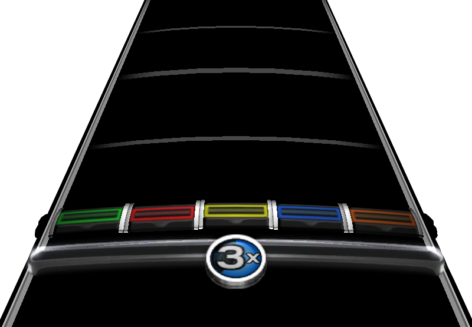 | 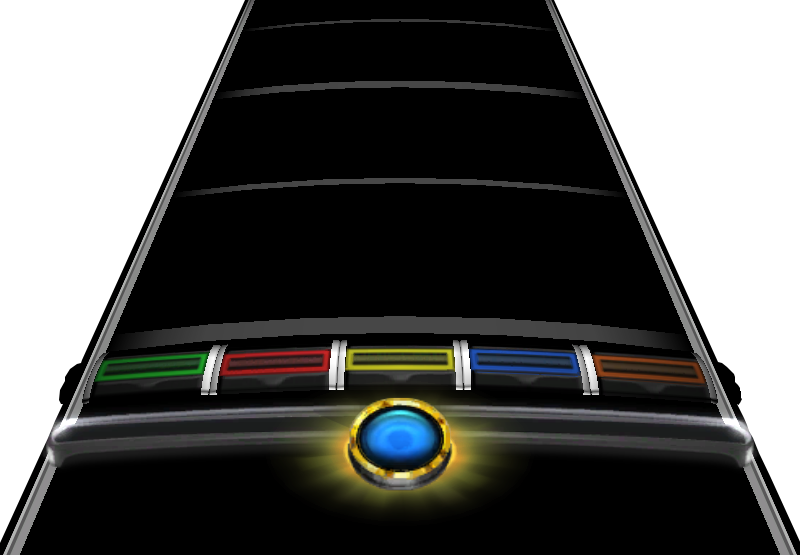 |

* Vocal Pitch:
	* *Toggles the full-size vocal highway. Off turns it into slim mode, like in online, similar to Clone Hero's vocals.*
	
| Vocal Pitch On |
|---|
|  |

| Vocal Pitch Off |
|---|
|  |

#### STARTUP:
* Intro Movie:
	* *Toggles whether or not the intro movie plays or automatically skips.*

* Title Screen:
	*Toggles whether the game has a title screen (with splash text) or automatically skips to the menus after the intro movie.*

#### TRACK ANGLE:
Adjust the angle of the highways for the game.

| Track Angle 0 (Default) |
|---|
| .") |

| Track Angle -50 (Max Setting) |
|---|
| .") |

#### COLORS:
* Adjust various colors for the highway and notes, separated by instrument type.

#### IN-GAME CUSTOMIZER
* Opens a real time editor to preview theme changes. Picks whatever song is highlighted in song library.

#### CAMERA:

* Menu Background:
	* *Sets the background on the menu screen.*

##### Post Processing:
* [DISABLE ALL/ENABLE ALL] :
	* *Disables all post processing and effects, giving the game a clean look.*

| ENABLE ALL |
|---|
| 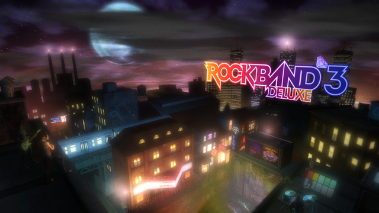 |

| DISABLE ALL |
|---|
|  |

* Motion Blur:
	* *Toggles the blurring when objects/characters are in motion. Removes some stylistic effects from some songs.*

[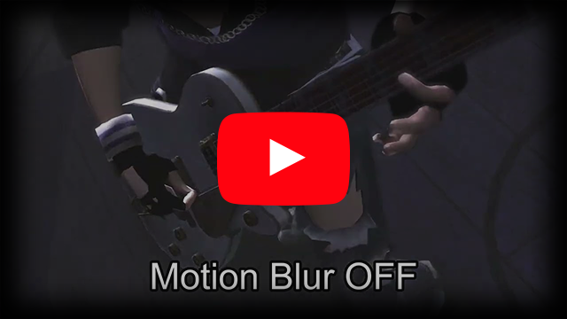](https://youtu.be/BOZ_7JObUcA "Motion Blur Comparison - YouTube")

* Camera Shake:
	* *Toggles the camera shake effect. Does not work past 144 Hz VBlank on RPCS3.*

|  |  |
|---|---|
|  |  

* Depth of Field:
	* *Toggles the camera focusing blur effect.*

|  |  |
|---|---|
| 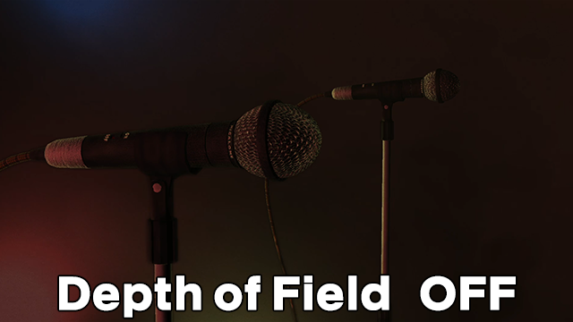 |  

* Film grain:
	* *Toggles the slight static the game has. Removes some stylistic effects from some songs.*

|  |  |
|---|---|
|  | 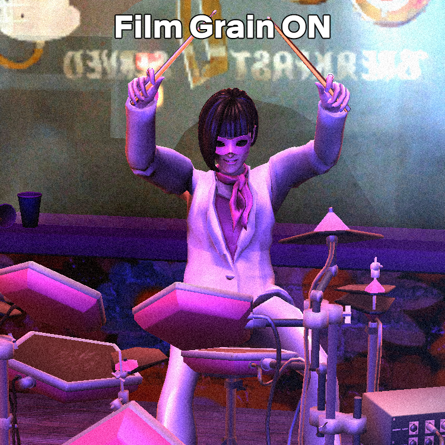 

* RELOAD BACKGROUND:
	* *Randomly picks another background for the menu.*

* SCREENSAVER:
	* *Disables all menus and input control, leaving the background up as a screensaver. The game will have be restarted after enabling this to exit.*

#### AUDIO & SFX:
* FC Sound:
	* *Select which sound plays when getting a full combo.*

* Menu Ambience:
	* *Toggles the background sound effects when in menus.*

* Instrument SFX:
	* *Toggles whether or not a sound effect plays when moving through the menu.*

* Jurgen Taunts:
	* *Plays insults from the legendary Jurgen, of Frets On Fire fame, when getting a bad score.*

* 69% Nice:
	* NICE, _NICE_, *NICE*

CONTROLLER:

* Change Instrument Type:
	* *Changes the current instrument slot to trick the game. Can still be able to change to the right instrument slot before a song starts. Can help with squeezing into online session where slots are taken up.*

* Remap Pad Controls:
	* *Changes the button layout for the controller that called the menu up. Can help with have weird mappings on Guitar Hero and older Rock Band controllers.*

#### DEBUG SETTINGS:
* *You accidentally enabled debug settings. Don't go in here unless a developer tells you to.*
