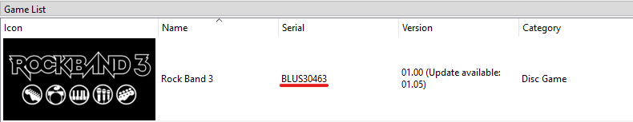
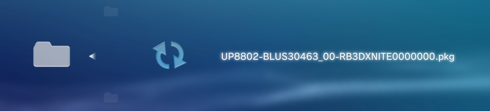

## *Rock Band 3 Deluxe* is a Massive Quality-of-Life Improvement Mod for PlayStation 3, Xbox 360, and Wii.

### With features like an FC indicator, custom track themes, an increased song limit, and various chart upgrades, *Rock Band 3 Deluxe* makes the experience as definitive as possible!

### 👉 See [Full Feature List](https://github.com/hmxmilohax/rock-band-3-deluxe/blob/main/dependencies/features.md#features)

### 📥 [Download Now!](https://github.com/hmxmilohax/rock-band-3-deluxe#%EF%B8%8F-what-youll-need)

 

 

# ✍️ What You'll Need

### Playing *Rock Band 3 Deluxe* requires these things:

- **A vanilla copy of Rock Band 3** for PS3, Xbox 360, or Wii that you can extract onto your PC.
    - The **USA** version is required for PS3 (`BLUS30463`).
- For Console: A **modded/hacked PS3, Xbox 360, or Wii** and a way to transfer files to it. An SD card is required for Wii.
- For Emulator: A PC capable of running RPCS3 or Dolphin.

 

# 📥 Downloads

*Rock Band 3 Deluxe recieves very frequent updates. You can click the `Watch` button (All Activity) to be notified about any updates that occur.*

## PlayStation 3

### 📥 [Rock Band 3 Deluxe for PS3](https://nightly.link/hmxmilohax/rock-band-3-deluxe/workflows/build/main/RB3DX-PS3.zip)

> The most recent Nightly build of *Rock Band 3 Deluxe* for PS3.

 

Continue to: 
    - [Installing on RPCS3](#-installing-on-rpcs3)
    - [Installing on PS3](#-installing-on-ps3)

## Xbox 360

### 📥 [Rock Band 3 Deluxe for Xbox 360](https://nightly.link/hmxmilohax/rock-band-3-deluxe/workflows/build/main/RB3DX-Xbox.zip)

> The most recent Nightly build of *Rock Band 3 Deluxe* for Xbox 360.

 

Continue to: 
    - [Installing on Xbox 360](#-installing-on-xbox-360)
    - [Installing on Xbox Series X/S](#-installing-on-xbox-series-xs-xenia-uwp)

## Wii

### 📥 [Rock Band 3 Deluxe for Wii](https://nightly.link/hmxmilohax/rock-band-3-deluxe/workflows/build/main/RB3DX-Wii-rawfiles.zip)

> The most recent Nightly build of *Rock Band 3 Deluxe* for Wii.

 

Continue to: 
    - [Installing on Wii](#-installing-on-wii)
    - [Installing on Dolphin Emulator](#-installing-on-dolphin-emulator)

## [YARG](https://yarg.in/) Song Updates

### 📥 [RB3DX Song Updates for YARG](https://nightly.link/hmxmilohax/rock-band-3-deluxe/workflows/build/main/RB3DX-YARG-Updates.zip)

> All song updates and upgrades included in RB3DX for use in YARG.

 

# 📩 How to Install

### Select your Platform of Choice

  - [RPCS3 (Recommended for PC)](#-installing-on-rpcs3)
  - [PlayStation 3](#-installing-on-ps3)
  - [Xbox 360](#-installing-on-xbox-360)
  - [Wii](#-installing-on-wii)
  - [Dolphin Emulator](#-installing-on-dolphin-emulator)
  - [Xbox Series X/S (Xenia UWP)](#-installing-on-xbox-series-xs-xenia-uwp)
  - [Xenia (Advanced)](#-installing-on-xenia-advanced)
 

## 📩 Installing on [RPCS3](https://rpcs3.net/)

* **Install your North American copy of Rock Band 3** through the emulator. The [**official RPCS3 site covers this nicely**](https://rpcs3.net/quickstart).
  * Remember, **Rock Band 3 needs to be** ***BLUS30463***. RPCS3 will tell you this in the game selection GUI under the `Serial` column.

* Download [**Rock Band 3 Deluxe for PS3**](https://nightly.link/hmxmilohax/rock-band-3-deluxe/workflows/build/main/RB3DX-PS3.zip). 
  * Extract the zip and **drag and drop the `.pkg` file on top of the main RPCS3 window** to install it.
  * Select `Yes` to confirm.

### ✅ ***Rock Band 3 Deluxe is now installed!***

We highly recommend you check out [**Optional Upgrades**](#-optional-upgrades) for songs and other cool stuff you can add to your game.

 

***Sidenote:*** *we recommend* ***enabling `Write Color Buffers`*** *for Rock Band 3 to prevent any character model issues.*

 

## 📩 Installing on PS3

**NOTE: You WILL need a HACKED/MODDED (CFW or HFW/HEN) PS3 in order to play this mod on console. We hope this is clear.**

**NOTE: *Rock Band 3 Deluxe* only works with** ***North American (`BLUS30463`)*** **copies of the game on PS3.**

* Download [**Rock Band 3 Deluxe for PS3**](https://nightly.link/hmxmilohax/rock-band-3-deluxe/workflows/build/main/RB3DX-PS3.zip). 
  * Extract the zip and copy the `.pkg` file to the root of a FAT32 formatted USB drive.
  * Remove it from your PC and plug it in to the *rightmost* USB port on your PS3.
  * Navigate to `Package Manager > Install Package Files > Standard` in the XMB and install it just like any other package.

### ✅ ***Rock Band 3 Deluxe is now installed!***

We highly recommend you check out [**Optional Upgrades**](#-optional-upgrades) for songs and other cool stuff you can add to your game.

 

## 📩 Installing on Xbox 360

**NOTE: You WILL need a HACKED/MODDED (RGH or JTAG) Xbox 360 in order to play this mod on console. We hope this is clear.**

* **Install your vanilla copy of Rock Band 3** to your console's hard drive.
  * In case anything goes wrong, we recommend that you **rename `default.xex` to `default_vanilla.xex`**.

* **Disable updates** for Rock Band 3 in Aurora. *Rock Band 3 Deluxe* rolls `TU5` into its base installation.

* Download [**Rock Band 3 Deluxe for Xbox 360**](https://nightly.link/hmxmilohax/rock-band-3-deluxe/workflows/build/main/RB3DX-Xbox.zip). 
  * **Copy the contents of it to where your copy of Rock Band 3 is installed** (we recommend using FTP to do so).
  * Select `Yes` to overwrite the files if it asks you to.

### ✅ ***Rock Band 3 Deluxe is now installed!***

We highly recommend you check out [**Optional Upgrades**](#-optional-upgrades) for songs and other cool stuff you can add to your game.

 

***Sidenote:*** We also recommend **clearing your song cache**, as well as your **system cache**.
* *To clear your **song cache**, navigate to `System Settings > Storage > Rock Band 3` and delete the song cache.*
* *To clear your **system cache**, navigate to `System Settings > Storage` and press `Y` to clear the system cache.*

 

## 📩 Installing on Wii

**NOTE: You WILL need a HACKED/MODDED/HOMEBREWED Wii in order to play this mod on console. You also cannot play this mod on a Wii Mini. We hope this is clear.**

**NOTE: *Rock Band 3 Deluxe* is compatible with both Wii and vWii, as well as [Dolphin Emulator](#-installing-on-dolphin-emulator).**

 

***You need to have [RB3Enhanced](https://rb3e.rbenhanced.rocks/) installed before you do anything. Install that first using its guide and then come back.***

* Download [**Rock Band 3 Deluxe for Wii**](https://nightly.link/hmxmilohax/rock-band-3-deluxe/workflows/build/main/RB3DX-Wii-rawfiles.zip).
* Copy the `rb3` folder to the **root of your SD card**. Click `Yes` to overwrite the files if it asks you to.
* When you launch *RB3Enhanced* through the Homebrew Channel, ***Deluxe*** **will be loaded as well**.

### ✅ ***Rock Band 3 Deluxe is now installed!***

 

***NOTE: The following features are currently unsupported on Wii:***
* FC Indicator
* Track Themes
* Overdrive Color Selection
* RB4/Rivals Menu Themes
* Venue FPS Selection
* Post Processing Menu
* Song Title Overlay Customization
* Song Upgrades
* currentsong.txt/json
* RB3DX Discord Rich Presence (for Dolphin)
* Saving *Deluxe Settings* for future sessions
* Debug Logging

 

## 📩 Installing on [Dolphin Emulator](https://dolphin-emu.org/)

* **Enable `Insert SD Card` and `Automatically Sync with Folder`** in your Dolphin config under the `Wii` tab in SD Card Settings.
* Right-click Rock Band 3 in your games list and **set it as your Default ISO**.
* Download the latest version of [**RB3Enhanced**](https://rb3e.rbenhanced.rocks/) for Wii. ***This is required in order to run Deluxe***.
    * **Copy the files to `\Load\WiiSDSync\`** in your Dolphin Emulator folder. This is usually in Documents.
* Download [**Rock Band 3 Deluxe for Wii**](https://nightly.link/hmxmilohax/rock-band-3-deluxe/workflows/build/main/RB3DX-Wii-rawfiles.zip).
    * Copy the `rb3` folder to `\Load\WiiSDSync\`.
    * Click `Yes` to overwrite the files if it asks you to.
* Launch the *RB3Enhanced* loader to **start** ***RB3Enhanced*** **alongside** ***Rock Band 3 Deluxe***.
    * Either: click `Open` on the top left, navigate to `\Load\WiiSDSync\rb3\rb3e\` and **open `launcher.dol`**.
    * Or: **add `\Load\WiiSDSync\rb3\rb3e\` as a game folder** in your game path settings.

### ✅ ***Rock Band 3 Deluxe is now installed!***

 

***NOTE: The following features are currently unsupported on Wii:***
* FC Indicator
* Track Themes
* Overdrive Color Selection
* RB4/Rivals Menu Themes
* Venue FPS Selection
* Post Processing Menu
* Song Title Overlay Customization
* Song Upgrades
* currentsong.txt/json
* RB3DX Discord Rich Presence (for Dolphin)
* Saving *Deluxe Settings* for future sessions
* Debug Logging

 

## 📩 Installing on Xbox Series X/S ([Xenia UWP](https://github.com/SirMangler/xenia/releases))

**NOTE: You WILL need an Xbox Series X/S running in [Developer Mode](https://learn.microsoft.com/en-us/windows/uwp/xbox-apps/devkit-activation). We hope this is clear.**

* **Extract and copy your vanilla copy of Rock Band 3** to your USB drive.
  * In case anything goes wrong, we recommend that you **rename `default.xex` to `default_vanilla.xex`**.

* Download [**Rock Band 3 Deluxe for Xbox 360**](https://nightly.link/hmxmilohax/rock-band-3-deluxe/workflows/build/main/RB3DX-Xbox.zip).
  * **Copy the contents of it and paste them on top of your vanilla copy of Rock Band 3**.
  * Click `Yes` to overwrite the files if it asks you to.

### ✅ ***Rock Band 3 Deluxe is now installed!***

We highly recommend you check out [**Optional Upgrades**](#-optional-upgrades) for songs and other cool stuff you can add to your game.

 

***Sidenote:*** *we recommend* ***enabling `Readback Resolve`*** *in Xenia settings to prevent any character model issues.*

 

## 📩 Installing on Xenia (Advanced)

*Follow [**Building (Advanced)**](#-building-advanced) first in order to properly follow this guide.*

* **Extract your vanilla copy of Rock Band 3** and copy the contents of the `gen` folder to `\_build\xbox\gen\`.

* Then, **navigate to `windows_bats`** if you're on Windows or **`user_scripts`** if you're on Linux and **run `build_xenia` to automatically update, build, and run Rock Band 3 Deluxe.**
  * *You need to run this script every time in order to play and update the game.*

* If your controller does not respond, navigate to the `_xenia` folder and **map your controller with x360ce**.
  * When it asks you to create `xinput1_3.dll`, create it and **rename it to `xinput1_4.dll`**.
  * If your controller is mapped and recognized and still doesn't register any inputs, unplug it from your PC and plug it back in while Xenia is still open.

### ✅ ***Rock Band 3 Deluxe is now installed!***

We highly recommend you check out [**Optional Upgrades**](#-optional-upgrades) for songs and other cool stuff you can add to your game.

 

***Sidenote:*** *if you're experiencing issues regarding character models,*

* Navigate to `_xenia`, open `xenia-canary.config.toml` in your text editor of choice.
* Change the following settings (you may need to press `CTRL + F` to find these):
  *  `gpu` from `vulkan` to `d3d12`,
  *  `d3d12_readback_resolve` from `false` to `true`. 

*This will fix all texture issues but will drastically affect the framerate, you also may experience BSODs. If you don't want to deal with any of this, we recommend using [RPCS3](#-installing-on-rpcs3) instead.*

 

# 🔥 Optional Upgrades

### These are some optional, but very handy additions you can make to your *Rock Band 3 Deluxe* installation.

  - [Additional Songs](#-additional-songs)
    - [RPCS3](#-installing-songs-on-rpcs3)
    - [PS3](#-installing-songs-on-ps3)
    - [Xbox 360](#-installing-songs-on-xbox-360)
    - [Xenia](#-installing-songs-on-xenia-desktop-and-uwp)
  - [Custom Textures](#-custom-textures-ps3360-only)

 

## 🎵 Additional Songs

You can find song packs compatible with all Rock Band titles for both platforms on [**This Spreadsheet**](https://docs.google.com/spreadsheets/d/1-3lo2ASxM-3yVr_JH14F7-Lc1v2_FcS5Rv_yDCANEmk/edit#gid=0).

You can also use [**Onyx Music Game Toolkit**](https://github.com/mtolly/onyxite-customs) to generate your own custom song packs for Rock Band games or convert Xbox 360 packs to PS3, and vice versa. Converting custom songs from games like Clone Hero is a breeze.

### 🎵 Installing Songs on RPCS3

* Download a PS3 song pack of your choice and open RPCS3.
* Drag and drop the song pack you want to install on top of the main RPCS3 window and select `Yes` to install it.

### 🎵 Installing Songs on PS3

* Download a PS3 song pack of your choice and put it on the root of a USB drive.
* Open `Package Manager` and select the song pack you want to install.

### 🎵 Installing Songs on Xbox 360

* Download an Xbox 360 song pack of your choice.
* Copy it to its respective folder.

***For RB3 LIVE files, install them to:***

***For RB3 CON files, install them to:***

***For RB2 LIVE files, install them to:***

### 🎵 Installing Songs on Xenia (Desktop and UWP)

* Download an Xbox 360 song pack of your choice.
* Open Xenia, navigate to `File > Install Content`, and select your song pack(s) of choice. You can select more than one at a time.
  * Xenia supports both CON and LIVE files.

* If you're on Xbox Series X/S, copy the entire `content` folder to your USB drive.
  * Click `Yes` to overwrite the files if it asks you to.

 

## 🎨 Custom Textures (PS3/360 Only)

By default, *Rock Band 3 Deluxe* contains a variety of custom textures, found in the `Deluxe Settings` menu in-game, as well as a way to import your own with relative ease.

### Importing Your Own Textures

*Follow [**Building (Advanced)**](#-building-advanced) first in order to properly follow this guide.*

* Copy any `.jpg`, `.png`, or `.bmp` file into `\custom_textures\***\`, then navigate back to `windows_bats` and run `process_textures_***.bat`.
  * These will make them show up in game, resize your images accordingly (including those with arbitrary resolutions), and convert them to the proper format for *Rock Band 3 Deluxe* to read.

***You will need to rebuild Rock Band 3 Deluxe in order for these to take effect.***

 

# 🔨 Building (Advanced)

### Installing Python (Required)

* Head to the [**Python downloads**](https://www.python.org/downloads/), download and install Python (version 3.9 or later).
  * ***Select "Add python.exe to PATH"*** on the installer.

### Initializing the Repo

* Go to the **[Releases](https://github.com/hmxmilohax/rock-band-3-deluxe/releases)** of this repo and **download `init_repo.py`**.
  * Make a new **empty** folder, **put `init_repo.py` in the folder, and run it**. This will pull the repo down for you and make sure you're completely up to date. **This will take some time.**

### ***The folder should look like this once it's done:***

### ✅ ***The Rock Band 3 Deluxe repo is now set up!***

From here, you can make any personal modifications to the game or build it yourself.

* Navigate to `windows_bats` if you're on Windows or `user_scripts` if you're on Linux.
  * Run the `build_` script for your platform of choice to build *Rock Band 3 Deluxe*.
  * Built contents will be in the `_build` folder on the root of the repo.

You can now return to [**Installing on Xenia (Advanced)**](#-installing-on-xenia-advanced) or [**Custom Textures**](#-custom-textures).

 

# 🖥️ Dependencies

[Git for Windows](https://gitforwindows.org/) - CLI application to allow auto updating Deluxe repo files

[Dot Net 6.0 Runtime](https://dotnet.microsoft.com/en-us/download/dotnet/6.0/runtime) - Needed to run ArkHelper

[Python](https://www.python.org/downloads/) - For user script functionality (NOTE: 3.9 or newer is highly recommended!)

[Mackiloha](https://github.com/PikminGuts92/Mackiloha) - ArkHelper for building Deluxe - SuperFreq for building .bmp_xbox highway images

[swap_rb_art_bytes.py](https://github.com/PikminGuts92/re-notes/blob/master/scripts/swap_rb_art_bytes.py) - Python script for converting Xbox images to PS3

[dtab](https://github.com/mtolly/dtab) - For serializing `.dtb` script files
