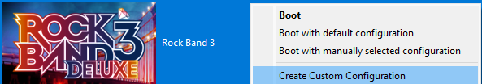
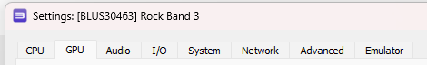
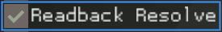
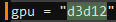
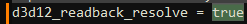
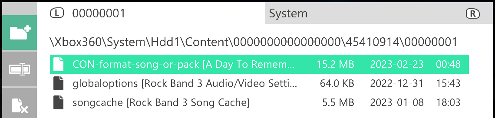
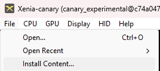
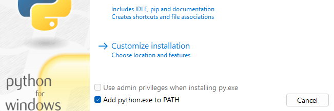

# Rock Band 3 Deluxe

# Introduction

### Rock Band 3 Deluxe is a Massive Quality-of-Life Improvement Mod by [MiloHax](https://github.com/hmxmilohax)

This guide contains full instructions on how to install Rock Band 3 Deluxe for PlayStation 3 or Xbox 360.

*There is also a (no longer supported) Wii version available in [this branch](https://github.com/hmxmilohax/rock-band-3-deluxe/tree/wii).*

# Table of Contents  
- [Features](#features)
  - [Quality of Life](#quality-of-life)
  - [Authoring](#authoring)
  - [Additional Modifications](#additional-modifications)
- [What You'll Need](#what-youll-need)
- [Downloads](#downloads)
- [How to Install](#how-to-install)
  - [Installing on RPCS3 (Recommended for PC)](#installing-on-rpcs3-recommended-for-pc)
  - [Installing on PS3](#installing-on-ps3)
  - [Installing on Xbox 360](#installing-on-xbox-360)
  - [Installing on Xbox Series X/S (Xenia UWP)](#installing-on-xbox-series-xs-xenia-uwp)
  - [Installing on Xenia (Advanced)](#installing-on-xenia-advanced)
- [Optional Upgrades](#optional-upgrades)
  - [Songs](#songs)
  - [rb3_plus Keys Upgrades](#rb3_plus-keys-upgrades)
  - [Custom Textures](#custom-textures)
- [Repo Setup (Advanced)](#repo-setup-advanced)
- [Dependencies](#dependencies)

# Features

## Quality of Life
* [Custom settings loader](https://github.com/hmxmilohax/dx-settings-loader) as a frontend for Xbox and Xenia
* Max song limit increased to 8000. Above 5000 can lead to instability issues, use with caution.
* Song select ambient noise modifier, default disabled
* New menu, "Deluxe Settings", in game for additional modifications
* Selectable song speed and track speed by 5% increments
* Selectable venue framerate up to 60fps
* Selectable venues, including a "Black Venue" with decreased load times and system load
* Fast start executable modification by ihatecompvir
* Additional intro skip scripting to load the main menu by default and automatically start loading installed content
* Press select to restart the section in practice mode
* Default difficulty on first load is Expert
* Song title always visible modifier
* Keys on Guitar unlocked without meeting requirements
* Manual calibration adjusts by 1ms instead of 5ms

## Authoring
* Autoplay modifier for chart demos
* Gameplay watermarks to deter abuse of autoplay including -
    * Disabling autosave
    * Replacing endgame percentage with `BOT`
    * Manipulating MTV Overlay
* Cycle camera menu button - available in-game when autoplay is enabled
* Rock Revolution drums register as Pro Keys on PS3/RPCS3, to allow easy demos for pro instruments
* Guitar Hero World Tour drums register as Pro Guitar/Bass on PS3/RPCS3, to allow easy demo for pro instruments

## Additional Modifications
* Selectable colors per fret/note/sustain (It works on Pro Drums/non-Pro Keys too!)
* Selectable Overshell colors
* Huge variety of custom song sources supported
* All official exports, DLC, and RBN sorted into individual sources
* Auto activating drum modifier (no fills mode)
* Translations for Spanish, French, German
* Post processing toggle - disables/reenables post processing in-game, or in menus
* Screensaver mode - remove UI elements from menus to view the background vignette unobstructed (it will softlock your game, so be careful!)
* Nice (69%) and Awesome Choke (98-99%) callouts on solo completion
* New main menu music pulled from other Rock Band titles
* No crowd modifier
* No whammy effect modifier
* No sustain trails modifier
* Rock Band 2 Sustain look modifier
* Upgrades/fixes for tons of songs from [rb3_plus](https://github.com/rjkiv/rb3_plus)
* Compatibility with [RB3Enhanced](https://github.com/RBEnhanced/RB3Enhanced) for Xbox 360
* Fast start, Song Blacklist, UGC Demo, Anti Debugger patches from [RB3Enhanced](https://github.com/RBEnhanced/RB3Enhanced) Embedded directly into DX binaries.

# What You'll Need

### Playing Rock Band 3 Deluxe requires these things:

- **A vanilla copy of Rock Band 3** for PS3 or Xbox 360 that you can extract onto your PC. The **USA** version is required for PS3 (`BLUS30463`)
- For Console: A **modded/hacked PS3 or Xbox 360** and a way to transfer files to it, we recommend using FTP
- For Emulator: A **mid-to-high-end PC** capable of running RPCS3

# Downloads

## PlayStation 3

### [Rock Band 3 Deluxe (Base) for PS3](https://nightly.link/hmxmilohax/rock-band-3-deluxe/workflows/build/main/RB3DX-PS3-Base.zip)

[RB3DX (With rb3_plus Keys Upgrades) for PS3](https://nightly.link/hmxmilohax/rock-band-3-deluxe/workflows/build/main/RB3DX-PS3-keys.zip)

[RB3DX (Without Chart Fixes) for PS3](https://nightly.link/hmxmilohax/rock-band-3-deluxe/workflows/build/main/RB3DX-PS3-original-mids.zip)

[RB3DX (Stock Instrument Mapping) for PS3](https://nightly.link/hmxmilohax/rock-band-3-deluxe/workflows/build/main/RB3DX-PS3-stock-instrument-mapping.zip)

## Xbox 360

### [Rock Band 3 Deluxe (Base) for Xbox 360](https://nightly.link/hmxmilohax/rock-band-3-deluxe/workflows/build/main/RB3DX-Xbox-Base.zip)

[RB3DX (With rb3_plus Keys Upgrades) for Xbox 360](https://nightly.link/hmxmilohax/rock-band-3-deluxe/workflows/build/main/RB3DX-Xbox-keys.zip)

[RB3DX (Without Chart Fixes) for Xbox 360](https://nightly.link/hmxmilohax/rock-band-3-deluxe/workflows/build/main/RB3DX-Xbox-original-mids.zip)

[RB3DX (Series X/S Xenia) for Xbox 360](https://nightly.link/hmxmilohax/rock-band-3-deluxe/workflows/build/main/RB3DX-Xbox-Base-Force-Guitar-Controller.zip)

[RB3DX (Series X/S Xenia Without Chart Fixes) for Xbox 360](https://nightly.link/hmxmilohax/rock-band-3-deluxe/workflows/build/main/RB3DX-Xbox-original-mids-Force-Guitar-Controller.zip)

# How to Install

## Installing on [RPCS3](https://rpcs3.net/) (Recommended for PC)

* **Install your North American copy of Rock Band 3** through the emulator. The [**official RPCS3 site covers this nicely**](https://rpcs3.net/quickstart).
  * Remember, **you need to be running** ***BLUS30463***. RPCS3 will tell you this in the game selection GUI under the `Serial` column.
  * Once your vanilla copy is installed, **do NOT touch it**. Deluxe installs to a separate folder.

* **If this is your first time installing**, you will need the [**latest update for Rock Band 3**](http://b0.ww.np.dl.playstation.net/tppkg/np/BLUS30463/BLUS30463_T4/e52d21c696ed0fcf/UP8802-BLUS30463_00-ROCKBAND3PATCH05-A0105-V0100-PE.pkg) installed on RPCS3.
  * *Right-click and select `Save link as...` to start the download*, then **drag and drop it on top of the main RPCS3 window** to install it.

* Download [**Rock Band 3 Deluxe for PS3**](#playstation-3). 
  * **Copy the contents of it to `\dev_hdd0\game\BLUS30463\`** in your RPCS3 directory. Click `Yes` to overwrite the files.

***Rock Band 3 Deluxe is now installed!*** We highly recommend you check out [**Optional Upgrades**](#optional-upgrades) for songs and other cool stuff you can add to your game.

**To update Rock Band 3 Deluxe**, [**re-download it**](#playstation-3) and repeat the above steps. You can click the `Watch` button (All Activity) to be notified about any updates that occur.

***Sidenote:*** *we recommend* ***enabling `Write Color Buffers`*** *for Rock Band 3 to prevent any character model issues.*

## Installing on PS3

**NOTE: You WILL need a HACKED/MODDED (CFW or HFW/HEN) PS3 in order to play this mod on console. We hope this is clear.**

**NOTE: Rock Band 3 Deluxe only works with** ***North American (`BLUS30463`)*** **copies of the game on PS3.**

* **If this is your first time installing**, you will need the **latest update for Rock Band 3** installed on your system.
  * Insert our mount your disc, press `Triangle` on it, and select `Check for Update`. Update to version `1.05` if it asks you.

* Download [**Rock Band 3 Deluxe for PS3**](#playstation-3). 
  * **Copy the contents of it to `\dev_hdd0\game\BLUS30463\`** on your PS3's hard drive (we recommend using FTP to do so). Click `Yes` to overwrite the files.

***Rock Band 3 Deluxe is now installed!*** We highly recommend you check out [**Optional Upgrades**](#optional-upgrades) for songs and other cool stuff you can add to your game.

**To update Rock Band 3 Deluxe**, [**re-download it**](#playstation-3) and repeat the above steps. You can click the `Watch` button (All Activity) to be notified about any updates that occur.

***Sidenote:*** *if your Guitar Hero or Rock Revolution drum kit shows up as the wrong instrument, download* [***this build***](https://nightly.link/hmxmilohax/rock-band-3-deluxe/workflows/build/main/RB3DX-PS3-stock-instrument-mapping.zip) *instead.*

## Installing on Xbox 360

**NOTE: You WILL need a HACKED/MODDED (RGH or JTAG) Xbox 360 in order to play this mod on console. We hope this is clear.**

* **Install your vanilla copy of Rock Band 3** to your console's hard drive.
  * In case anything goes wrong, we recommend that you **rename `default.xex` to `default_vanilla.xex`**.

* **Disable updates** for Rock Band 3 in Aurora. Rock Band 3 Deluxe rolls `TU5` into its base installation.

* Download [**Rock Band 3 Deluxe for Xbox 360**](#xbox-360). 
  * **Copy the contents of it to where your copy of Rock Band 3 is installed** (we recommend using FTP to do so). Select `Yes` to overwrite the files.

* We also recommend **clearing your song cache**, as well as your **system cache**.
  * *To clear your **song cache**, navigate to `System Settings > Storage > Rock Band 3` and delete the song cache.*
  * *To clear your **system cache**, navigate to `System Settings > Storage` and press `Y` to clear the system cache.*

***Rock Band 3 Deluxe is now installed!*** We highly recommend you check out [**Optional Upgrades**](#optional-upgrades) for songs and other cool stuff you can add to your game.

**To update Rock Band 3 Deluxe**, [**re-download it**](#xbox-360) and repeat the above steps. You can click the `Watch` button (All Activity) to be notified about any updates that occur.

## Installing on Xbox Series X/S ([Xenia UWP](https://github.com/SirMangler/xenia/releases))

**NOTE: You WILL need an Xbox Series X/S running in [Developer Mode](https://learn.microsoft.com/en-us/windows/uwp/xbox-apps/devkit-activation). We hope this is clear.**

* **Extract and copy your vanilla copy of Rock Band 3** to your USB drive.
  * In case anything goes wrong, we recommend that you **rename `default.xex` to `default_vanilla.xex`**.

* Download [**Rock Band 3 Deluxe for Xbox 360**](#xbox-360). Xenia UWP currently does not have guitar support so you need to download one of the `Series X/S Xenia` versions.
  * **Copy the contents of it and paste them on top of your vanilla copy of Rock Band 3**. Click `Yes` to overwrite the files.

***Rock Band 3 Deluxe is now installed!*** We highly recommend you check out [**Optional Upgrades**](#optional-upgrades) for songs and other cool stuff you can add to your game.

**To update Rock Band 3 Deluxe**, [**re-download it**](#xbox-360) and repeat the above steps. You can click the `Watch` button (All Activity) to be notified about any updates that occur.

***Sidenote:*** *we recommend* ***enabling `Readback Resolve`*** *to prevent any character model issues.*

## Installing on Xenia (Advanced)

*Follow [**Repo Setup (Advanced)**](#repo-setup-advanced) first in order to properly follow this guide.*

* **Extract your vanilla copy of Rock Band 3** and copy the contents of the `gen` folder to `\_build\xbox\gen\`.

* Navigate to `_xenia` and **map your controller with x360ce**.
  * When it asks you to create `xinput1_3.dll`, create it and **rename it to `xinput1_4.dll`**.

* Then, **navigate to `windows_bats`** if you're on Windows or **`user_scripts`** if you're on Linux and **run `build_xenia` to automatically update, build, and run Rock Band 3 Deluxe.**
  * *You need to run this script every time in order to play and update the game. `run_xenia` will run the game only and won't update and build it unless a new update is available, so you can use that if `build_xenia` takes too long.*

***Rock Band 3 Deluxe is now installed!*** We highly recommend you check out [**Optional Upgrades**](#optional-upgrades) for songs and other cool stuff you can add to your game.

***Sidenote:*** *if your guitar is mapped and recognized and still doesn't register any inputs, unplug it from your PC and plug it back in while Xenia is still open.*

***Sidenote:*** *if you're experiencing issues regarding character models, navigate to `_xenia`, open `xenia-canary.config.toml` in your text editor of choice, and change `gpu` from `vulkan` to `d3d12` and `d3d12_readback_resolve` from `false` to `true` (you may need to press `CTRL + F` to find these). This will fix all texture issues but will drastically affect the framerate, you also may experience BSODs. If you don't want to deal with any of this, we recommend using* [***RPCS3***](#installing-on-rpcs3-recommended-for-pc) *instead.*

# Optional Upgrades

*These are some optional, but very handy additions you can make to your Rock Band 3 Deluxe installation.*

## Songs

You can find song packs compatible with all Rock Band titles for both platforms on [**This Spreadsheet**](https://docs.google.com/spreadsheets/d/1-3lo2ASxM-3yVr_JH14F7-Lc1v2_FcS5Rv_yDCANEmk/edit#gid=0).

You can also use [**Onyx Music Game Toolkit**](https://github.com/mtolly/onyxite-customs) to generate your own custom song packs for Rock Band games or convert Xbox 360 packs to PS3, and vice versa. Converting custom songs from games like Clone Hero is a breeze.

### Installing Songs on RPCS3

* Download a PS3 song pack of your choice and open RPCS3.
* Drag and drop the song pack you want to install on top of the main RPCS3 window and select `Yes` to install it.

### Installing Songs on PS3

* Download a PS3 song pack of your choice and put it on the root of a USB drive.
* Open `Package Manager` and select the song pack you want to install.

### Installing Songs on Xbox 360

* Download an Xbox 360 song pack of your choice.
* Copy it to its respective folder.

***For RB3 LIVE files, install them to:***

***For RB3 CON files, install them to:***

***For RB2 LIVE files, install them to:***

### Installing Songs on Xenia (Desktop and UWP)

* Download an Xbox 360 song pack of your choice.
* Open Xenia, navigate to `File > Install Content`, and select your song pack(s) of choice. You can select more than one at a time.
  * Xenia supports both CON and LIVE files.

* If you're on Xbox Series X/S, copy the entire `content` folder to your USB drive. Click `Yes` to overwrite the files if it asks you to.

## [rb3_plus](https://github.com/rjkiv/rb3_plus) Keys Upgrades

[rb3_plus](https://github.com/rjkiv/rb3_plus) features optional Keys and Pro Keys upgrades that you can install alongside Rock Band 3 Deluxe fairly easily. These upgrades include new audio files (.mogg's) for the upgraded songs. These take up additional file size and generally are a generation removed from the original audio mix with additional processing, but can be a great addition for any Keys or Pro Keys player.

You can download a build of Rock Band 3 Deluxe containing these upgrades for both [**PS3**](https://nightly.link/hmxmilohax/rock-band-3-deluxe/workflows/build/main/RB3DX-PS3-keys.zip) and [**Xbox 360**](https://nightly.link/hmxmilohax/rock-band-3-deluxe/workflows/build/main/RB3DX-Xbox-keys.zip).

## Custom Textures

Rock Band 3 Deluxe has a variety of custom textures, found in the `Deluxe Settings` menu in-game, as well as a way to import your own with relative ease.

### Importing Your Own Textures

*Follow [**Repo Setup (Advanced)**](#repo-setup-advanced) first in order to properly follow this guide.*

* Copy any `.jpg`, `.png`, or `.bmp` file into `\custom_textures\***\`, then navigate back to `windows_bats` and run `process_textures_***.bat`.
  * These will make them show up in game, resize your images accordingly (including those with arbitrary resolutions), and convert them to the proper format for Rock Band 3 Deluxe to read.

***You will need to rebuild Rock Band 3 Deluxe in order for these to take effect.***

# Repo Setup (Advanced)

### Installing Required Dependencies

* Install [**Git for Windows**](https://gitforwindows.org/), [**Dot Net 6.0 Runtime**](https://dotnet.microsoft.com/en-us/download/dotnet/6.0/runtime), and [**Python**](https://www.python.org/downloads/) (version 3.9 or later).
  * Install **Git** and **Dot Net 6.0 Runtime** with their default options, and ***select "Add python.exe to PATH"*** on the **Python** installer.

* Open a **new command prompt** (press `Win+R`, type `cmd` and press Enter), type in `pip install gitpython`, and press enter. Close the command prompt when it's done installing.

### Initializing the Repo

* Go to the **[Releases](https://github.com/hmxmilohax/rock-band-3-deluxe/releases)** of this repo and **download `_init_repo.bat`** if you're on Windows or **`_init_repo.sh`** if you're on Linux.
  * Make a new **empty** folder, **put `_init_repo` in the folder, and run it**. This will pull the repo down for you and make sure you're completely up to date. **This will take some time.**

### ***The folder should look like this once it's done:***

***The Rock Band 3 Deluxe repo is now set up!*** You can now return to [**Installing on Xenia (Advanced)**](#installing-on-xenia-advanced) or [**Custom Textures**](#custom-textures).

# Dependencies

[Git for Windows](https://gitforwindows.org/) - CLI application to allow auto updating Deluxe repo files

[Dot Net 6.0 Runtime](https://dotnet.microsoft.com/en-us/download/dotnet/6.0/runtime) - Needed to run ArkHelper

[Python](https://www.python.org/downloads/) - For user script functionality (NOTE: 3.9 or newer is highly recommended!)

[Mackiloha](https://github.com/PikminGuts92/Mackiloha) - ArkHelper for building Deluxe - SuperFreq for building .bmp_xbox highway images

[swap_rb_art_bytes.py](https://github.com/PikminGuts92/re-notes/blob/master/scripts/swap_rb_art_bytes.py) - Python script for converting Xbox images to PS3

[dtab](https://github.com/mtolly/dtab) - For serializing `.dtb` script files
