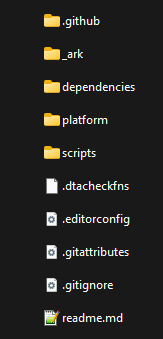

# Downloads and install instructions have been moved to our [brand new website](https://rb3dx.milohax.org/)!

   

# Welcome to the *Rock Band 3 Deluxe* repository!

### Below are instructions for building the game yourself. [Please visit our website if you're looking for downloads](https://rb3dx.milohax.org/).

   

# 📥 [Downloads](https://rb3dx.milohax.org/)

   

# 🔨 Building (NOT standard download and install)

## NOTE: This is for *building the game*, for developers and contributors.   If you're looking for downloads, [please visit our website](https://rb3dx.milohax.org/).

### Installing Python (Required)

* Head to the [**Python downloads**](https://www.python.org/downloads/), download and install Python (version 3.11 or later).
  * ***Select "Add python.exe to PATH"*** on the installer.

### Initializing the Repo

* Go to the **[Releases](https://github.com/hmxmilohax/rock-band-3-deluxe/releases)** of this repo and **download `init_repo.py`**.
  * Make a new **empty** folder, **put `init_repo.py` in the folder, and run it**.
      * This will pull the repo for you and install all required dependencies. **This will take some time.**
      * You may have to run the script multiple times on Windows.

### ***The folder should look something like this once it's done:***

### ✅ ***The Rock Band 3 Deluxe repo is now set up!***

From here, you can make any personal modifications to the game or build it yourself.

#### Windows `*.bat` files.

* Navigate to `scripts` if you're on Windows.
  * Run the `build_` script for your platform of choice to build *Rock Band 3 Deluxe*.
  * Built contents will be in the `out` folder on the root of the repo.

#### Manual

* Navigate to the root of the repo in your shell of choice.

* Run the following commands:
  * `python3 dependencies/python/configure_build.py <platform>`
  * `dependencies/<os>/ninja`

* Built contents will be in the `out` folder on the root of the repo.

### ✅ ***You have now built Rock Band 3 Deluxe!***

 

## 🎨 Custom Textures

*Follow [**Building (Advanced)**](#-building-advanced) first in order to properly follow this guide.*

* Copy any `.jpg`, `.png`, or `.bmp` file to the appropriate place in  `\_ark\dx\custom_textures\***\`.
* Re-build the game!

### ✅ ***Your custom textures have been converted and will show up ingame!***

 

# 🖥️ Dependencies

[Git for Windows](https://gitforwindows.org/) - CLI application to allow auto updating Deluxe repo files

[Dot Net 6.0 Runtime](https://dotnet.microsoft.com/en-us/download/dotnet/6.0/runtime) - Needed to run ArkHelper

[Python](https://www.python.org/downloads/) - For user script functionality (NOTE: 3.9 or newer is highly recommended!)

[Mackiloha](https://github.com/PikminGuts92/Mackiloha) - ArkHelper for building Deluxe - SuperFreq for building .bmp_xbox highway images

[swap_rb_art_bytes.py](https://github.com/PikminGuts92/re-notes/blob/master/scripts/swap_rb_art_bytes.py) - Python script for converting Xbox images to PS3

[dtab](https://github.com/mtolly/dtab) - For serializing `.dtb` script files

[RB3DXBuildPkgPS3](https://github.com/InvoxiPlayGames/RB3DXBuildPkgPS3) - For building an RB3DX PKG for PS3

[Wiimmfi ISO Patcher](https://wiimmfi.de/patcher/iso) - For self building an RB3DX image for Wii. Binary locally in repo due to clean download restraints
